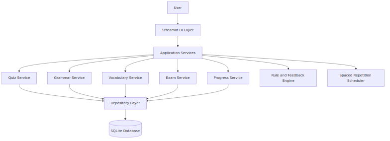

# Deutlit Architecture

This document describes the recommended target architecture for scaling Deutlit beyond a single-file prototype.

For interaction lifecycle diagrams, see [DATAFLOW.md](DATAFLOW.md).

## High-Level Architecture



Source file: [diagrams/architecture.mmd](diagrams/architecture.mmd)

## Layer Responsibilities

- Streamlit UI Layer: User interaction, page state, and visual components.
- Application Services: Business logic for quiz, grammar, vocabulary, exam, and progress flows.
- Repository Layer: Data access abstraction for questions, vocabulary, and user progress.
- SQLite Database: Local persistence for prototype and early releases.
- Rule and Feedback Engine: Explains answers and provides short grammar rationale.
- Spaced Repetition Scheduler: Determines review timing for vocabulary and weak concepts.

## Suggested Module Layout

```text
deutlit/
  app.py
  src/
    ui/
      pages/
    services/
      quiz_service.py
      grammar_service.py
      vocab_service.py
      exam_service.py
      progress_service.py
    data/
      repositories.py
      schema.sql
      seed_data.py
    models/
      question.py
      vocab_item.py
      user_progress.py
  tests/
    test_quiz_service.py
    test_grammar_service.py
```
