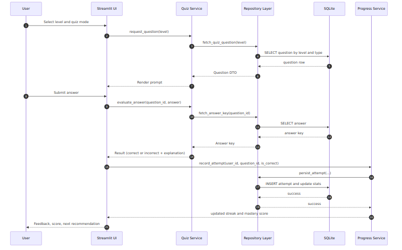

# Deutlit Data Flow

This document captures runtime data flow for key user interactions.

## Quiz Submission Lifecycle

Source file: [diagrams/dataflow.mmd](diagrams/dataflow.mmd)

## Notes

- Repository calls should use parameterized SQL queries.
- Progress updates should be non-blocking when possible.
- The same pattern can be reused for grammar and vocabulary exercises.
